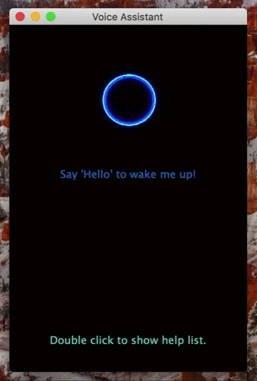
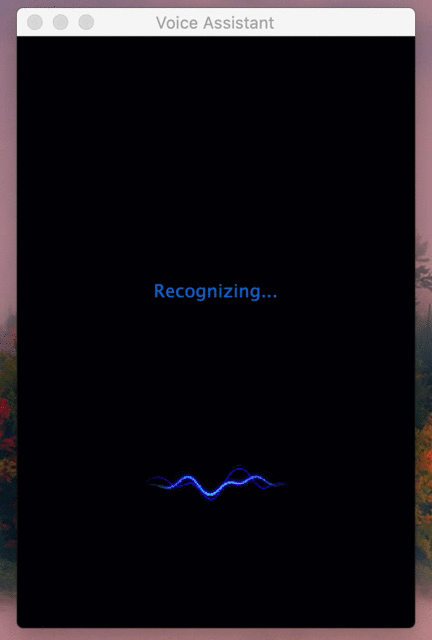

# Lab1-Voice Recognition

| Name         | ID      |
| ------------ | ------- |
| Yiteng Zhang | 1852137 |

[toc]

## 1. Modifications

### 1.1 GUI

#### Sleeping Statement


​                                                                              (Home page)

* Using stationary image instead of gif to illustrate that the assistant is in sleeping statement.
* Add notice “Double click to show help list.” to remind user that he/she can check the help list through double click.
* Add notice “Say 'Hello' to wake me up!” to remind user he/she can wake up the assistant through saying "hello".

#### Help list


​                                                                                  (Help list)

* Add help list which can show the command can be recognized by the assistant: 
  * "music" to wake up music player to play a music
  *  "note" to wake up the `Notability.app`
* Add notice "Double click to return" to remind user that he/she can go back to the main page through double click again.

#### Sleep statement -> Wake up statement



​                                                                              (Wake-up GIF)

* Add animation effects,  highlight the wake-up effect and enhance the user’s sense of interaction
* Add notice “Hi~what can I help you” to illustrate user that he/she can speak some command.

#### Recognizing statement



​                                                                            (Recognition GIF)

* Add animation effects, highlight the effect of receiving instructions

### 1.2 Code

#### Notice and GIF

```python
# set attributes of label
self.labelHello = QtWidgets.QLabel(self.centralwidget)
self.labelHello.setGeometry(QtCore.QRect(65, 180, 180, 35))
self.labelHello.setFont(font)
self.labelHello.setStyleSheet("color: rgb(0, 117, 210);")
self.labelHello.setTextFormat(QtCore.Qt.AutoText)
self.labelHello.setWordWrap(True)
self.labelHello.setObjectName("labelHello")
self.labelHello.setAlignment(Qt.AlignCenter)

# set text of labels
self.labelHello.setText(_translate("MainWindow", "Say \'Hello\' to wake me up!"))
self.labelWaked.setText("Hi~ what can I help you?")
self.labelSorry.setText("Sorry I couldn't hear you, please say 'Hello' again.")
self.label2click.setText(_translate("MainWindow", "Double click to show help list."))
self.labelHH.setText(_translate("MainWindow", "You can say:"))
self.labelH1.setText(_translate("MainWindow", "1. \"Music\"-Play a music"))
self.labelH2.setText(_translate("MainWindow", "2. \"Note\"-Open Notability.app"))
self.labelH3.setText(_translate("MainWindow", "3. \"Google\"-Open Google.com"))
self.labelH4.setText(_translate("MainWindow", "4. \"Calculate\"-Open Calculator"))
self.labelRec.setText("Recognizing...")

# set gif
self.voiceFig = QtWidgets.QLabel(self.centralwidget)
self.voiceFig.setGeometry(QtCore.QRect(85, 50, 150, 100))
self.voiceFig.setText("")
self.gif = QMovie("resources/index.gif")
self.gifNorm = QMovie('resources/normal.gif')
self.gifRecing = QMovie('resources/recognizing.gif')
self.voiceFig.setMovie(self.gif)
self.gif.start()
self.gifNorm.start()
self.gifRecing.start()
self.voiceFig.setScaledContents(True)
self.voiceFig.setObjectName("voiceFig")
```

#### Voice Recognition

Detect the user's voice command through the microphone, automatically stop when the voice cannot be detected, and perform voice recognition through recognize_sphinx

```python
import speech_recognition as sr
r = sr.Recognizer()

mic = sr.Microphone()
with mic as source:
    r.adjust_for_ambient_noise(source)
    audio = r.listen(source)
    
command = r.recognize_sphinx(audio)
```

#### Similarity Detection

Use the SuquenceMatcher of the difflib library to perform similarity detection and return the similarity of the two strings to be compared.

```python
def similarityBetween(s1, s2):
    return difflib.SequenceMatcher(None, s1, s2).quick_ratio()
```

#### Wake up animation

Realize the movement of the floating ball through manually adjusted frame-by-frame animation to ==simulate the effect of hovering==.

Move down a certain distance every 0.0005s, and the speed slows down as it approaches the target position to ==simulate the deceleration effect==.

~~~python
# start the movement of gif
# the closer to destination the lower the speed
step = 0.5
y = 50
while y < 200:
		self.ui.voiceFig.setVisible(False)
    y += step
    self.ui.voiceFig.move(85, int(y))
    self.ui.voiceFig.setVisible(True)
    time.sleep(0.0005)
step = 0.3
while y < 250:
    self.ui.voiceFig.setVisible(False)
    y += step
    self.ui.voiceFig.move(85, int(y))
    self.ui.voiceFig.setVisible(True)
    time.sleep(0.0005)
step = 0.2
while y < 280:
    self.ui.voiceFig.setVisible(False)
    y += step
    self.ui.voiceFig.move(85, int(y))
    self.ui.voiceFig.setVisible(True)
    time.sleep(0.0005)
step = 0.1
while y < 300:
    self.ui.voiceFig.setVisible(False)
    y += step
    self.ui.voiceFig.move(85, int(y))
    self.ui.voiceFig.setVisible(True)
    time.sleep(0.0005)
~~~
During the descending process, first exceed the target position a little and then retreat to ==simulate the effect of hovering==.

~~~python
# add an over-moved animation effect
step = 0.05
while y < 310:
    self.ui.voiceFig.setVisible(False)
    y += step
    self.ui.voiceFig.move(85, int(y))
    self.ui.voiceFig.setVisible(True)
    time.sleep(0.0005)
step = 0.02
while y > 300:
    self.ui.voiceFig.setVisible(False)
    y -= step
    self.ui.voiceFig.move(85, int(y))
    self.ui.voiceFig.setVisible(True)
    time.sleep(0.0005)
~~~

#### Double Click Event

Check the current state first when the double-click event is triggered

* state == 0：in sleeping statement, show help list
* state != 0：not in sleeping statement, no response

```python
    def mouseDoubleClickEvent(self, a0: QtGui.QMouseEvent) -> None:
        print('click click')
        # if self.state != 0:
        #     return
        global timer
        timer.cancel()
        if self.state != 0:
            return
        if self.helpFlag is True:
            self.helpFlag = False;
            self.ui.labelHello.setVisible(True)
            self.ui.label2click.setText("Double click to show help list.")
            self.ui.label2click.setVisible(True)
            timer = threading.Timer(0.1, self.wakeUp)
            timer.start()
        else:
            self.helpFlag = True
            self.ui.label2click.setText("Double click to return.")
            self.ui.labelHello.setVisible(False)
        self.ui.labelHH.setVisible(self.helpFlag)
        self.ui.labelH1.setVisible(self.helpFlag)
        self.ui.labelH2.setVisible(self.helpFlag)
        self.ui.labelH3.setVisible(self.helpFlag)
        self.ui.labelH4.setVisible(self.helpFlag)
```

## 2. Accuracy

### 2.1 Experiment

In order to ensure that the results of the experiment are not affected by the testers’ pronunciation standards, the pronunciations of the following experiments are all American pronunciations of `EuDic Dictionary`.  At the same time, in order to be as close as possible to the user's using of the voice assistant, the test voice is played with mobile phone against the microphone of the computer during the test

#### 1. Quiet Environment

Almost no noise.

| ID   | Voice     | Recognition Results | Similarity |
| ---- | --------- | ------------------- | ---------- |
| 1    | hello     | hello               | 1.0        |
| 2    | hello     | hello               | 1.0        |
| 3    | hello     | hello               | 1.0        |
| 4    | hello     | and though          | 0.27       |
| 5    | music     | need i think        | 0.12       |
| 6    | music     | it may take         | 0.25       |
| 7    | music     | me ask              | 0.36       |
| 8    | calculate | calculate           | 1.0        |
| 9    | calculate | calculate           | 1.0        |
| 10   | calculate | calculate           | 1.0        |

#### 2. Slightly Noisy Environment

Tested in a dormitory environment, only minor activities of the roommate.

| ID   | Voice     | Recognition Results | Similarity |
| ---- | --------- | ------------------- | ---------- |
| 1    | hello     | no                  | 0.29       |
| 2    | hello     | Hello               | 1.0        |
| 3    | hello     | well                | 0.67       |
| 4    | hello     | hello               | 1.0        |
| 5    | music     | i think             | 0.16       |
| 6    | music     | mary i think        | 0.24       |
| 7    | music     | they did            | 0.15       |
| 8    | calculate | calculate           | 1.0        |
| 9    | calculate | calculate           | 1.0        |
| 10   | calculate | don't in it         | 0.1        |

#### 3. Noisy Environment 

Tested in a classroom environment, there is relatively noisy environmental noise.

| ID   | Voice     | Recognition Results              | Similarity |
| ---- | --------- | -------------------------------- | ---------- |
| 1    | hello     | wow                              | 0.29       |
| 2    | hello     | and now                          | 0.17       |
| 3    | hello     | move on now to to live with love | 0.22       |
| 4    | hello     | you love to have one and how     | 0.18       |
| 5    | music     | you suck                         | 0.46       |
| 6    | music     | need i think                     | 0.38       |
| 7    | music     | five                             | 0.11       |
| 8    | calculate | talk to it                       | 0.32       |
| 9    | calculate | it late                          | 0.50       |
| 10   | calculate | calculated                       | 0.95       |

#### 3. Conclusions

When it's very quiet, the recognition accuracy is relatively high. However, it largely ranges when it comes to different instructions, for example 'hello' and 'calculate' are easier to be recognized than 'music'.

When there is little noise, the accuracy is less than the former, but it sometimes can recognize the correct.

When there is environmental noise, the effect is very poor, and it is almost impossible to recognize, and the following two kinds of wrong recognition will occur:

* The instruction has been said, but the detection doesn't  stop, and the environmental noise is recognized as a word
* One word is recognized as multiple shorter words
* The instruction is recognized as a similarly pronounced word

### 2.2 Potential Improvement

* From the perspective of recognition accuracy, we can reduce the impact of environmental sounds by adding some denoising algorithms, similar to the idea of Gaussian filtering in image processing, making the speech relatively smoother, while filtering out some slight sounds, and increasing the detection sensitivity of the end of the speech.
* From the perspective of interface design, animation interaction can be further increased, such as updating the animation in the recognition process, and real-time synchronization with the recognition, which can more effectively reflect the recognition in progress.