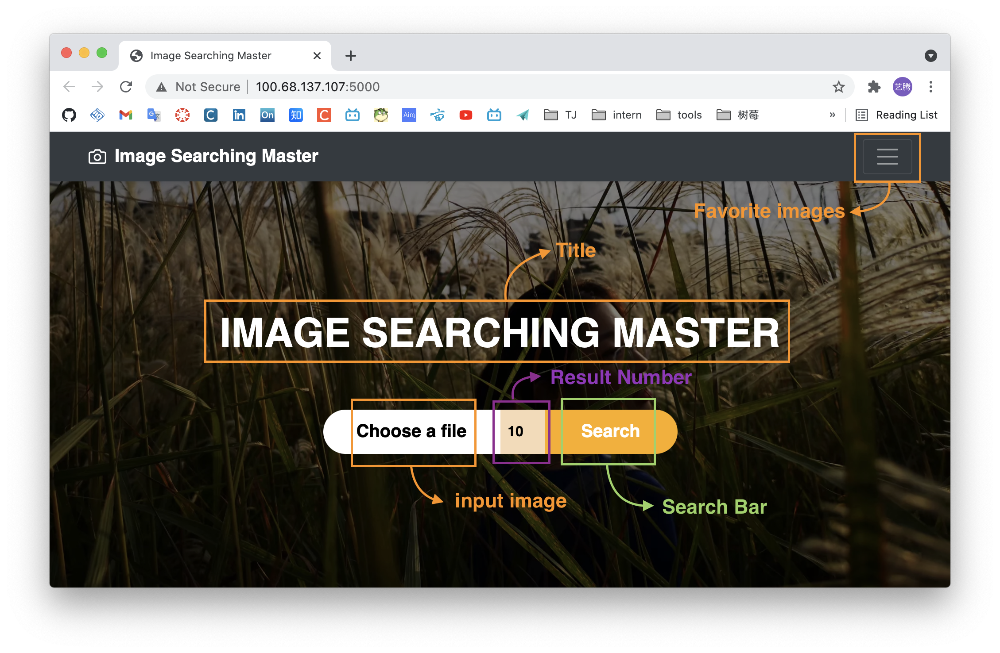
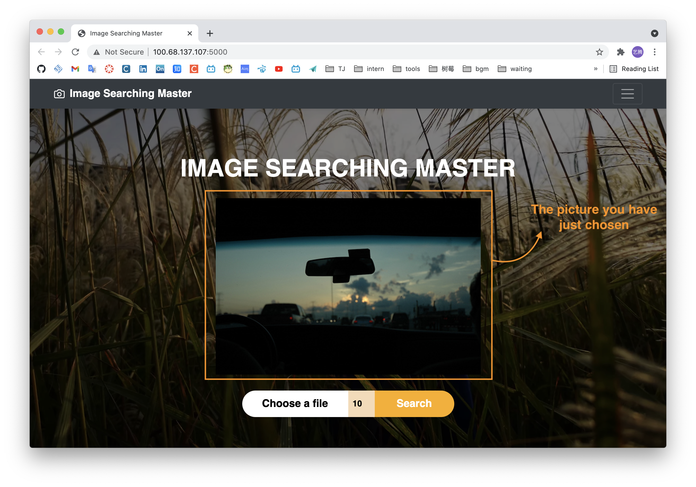
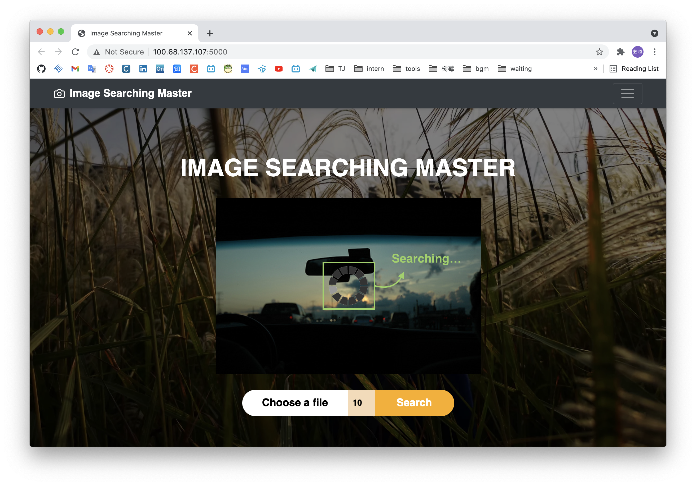
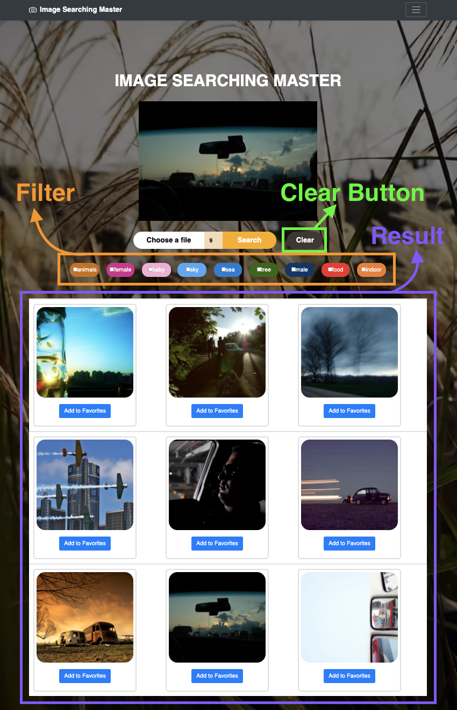
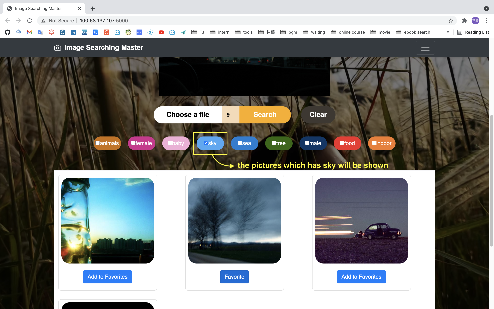
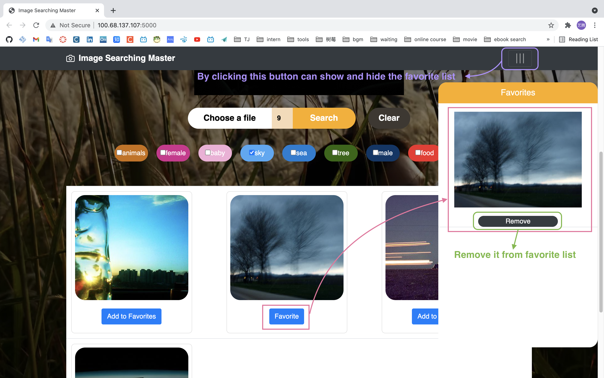

# README

## 1. How to run

* You have to put the `database` folder and the `imagenet` folder  and `saved_features_recom.txt` file under the `server` folder
* Then run the `rest-server.py`
* open the ip show in the console in your `chrome`

⚠️ If you cannot run it successfully, feel free to as me!

* tel: 18817802173
* WeChat: 18817802173
* Mail: 1852137@tongji.edu.cn

## 2. Functions

### Start Page

* The title `IMAGE SEARCHING MASTER` shows the function of this search engine.
* The button on the left-top side can show and hide the `favorite list`
* The `Choose a file` button allows users to choose a picture to upload
* The `Search` button allows users to start the searching process
* The number between allows users to decide to show how many result pictures.
* The `Clear` button which is shown after searching allows users to clear the page.



### View Window

Users can view the picture they have selected and can also change another one by re-click `Choose a file`  button.



### Searching

There will have a gif to indicate that the searching is processing.



### Review of Results

The results will be shown below the search block.



### Refinement

There's some filt tag below the search bar, once select some tag, the result will be changed, only show the pictures fitting ==at least one selected tag==.(As the yellow box in the below picture)




### Add Favorite Pictures

Users can add a picture in to Favorites by clicking the `Add to Favorites` button below the certian picture.(As the pink box in the below picture)

⚠️The favorite pictures are ==synchronized to the back-end==, so the next time users open the page ,the favorite pictures will be loaded in to the favorite list and show again. Not just front-end. There's a specific folder `favorites` to save the favorite pictures.



### Delete pictures from favorite list

Users can delete a picture from favorite list by clicking the `Remove ` under the certain picture.(As the green box in the above picture)

## 3. Project Structure

```
├── image_vectorizer.py
├── neighbor_list_recom.pickle
├── rest-server.py
├── saved_features_recom.txt
├── search.py
├── database
│   └── dataset
│       └── images
├── static
│   ├── favorites
│   │   └── im1456.jpg
│   ├── images
│   │   ├── ajax-loader.gif
│   │   └── background.jpg
│   └── result
│       └── database
│           └── dataset
├── templates
│   ├── base.html
│   └── index.html
└── uploads
```

