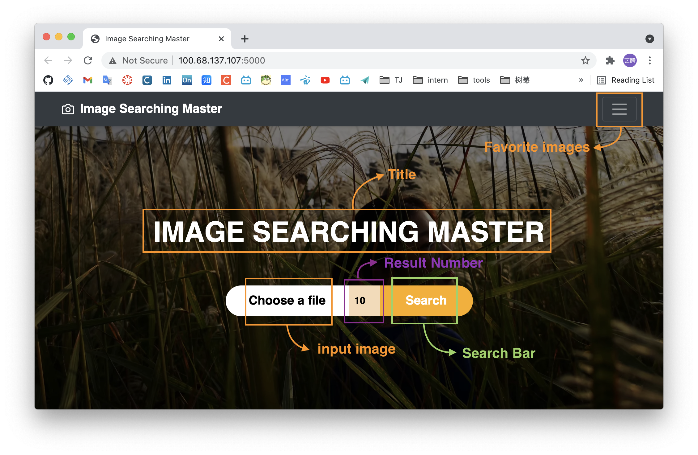
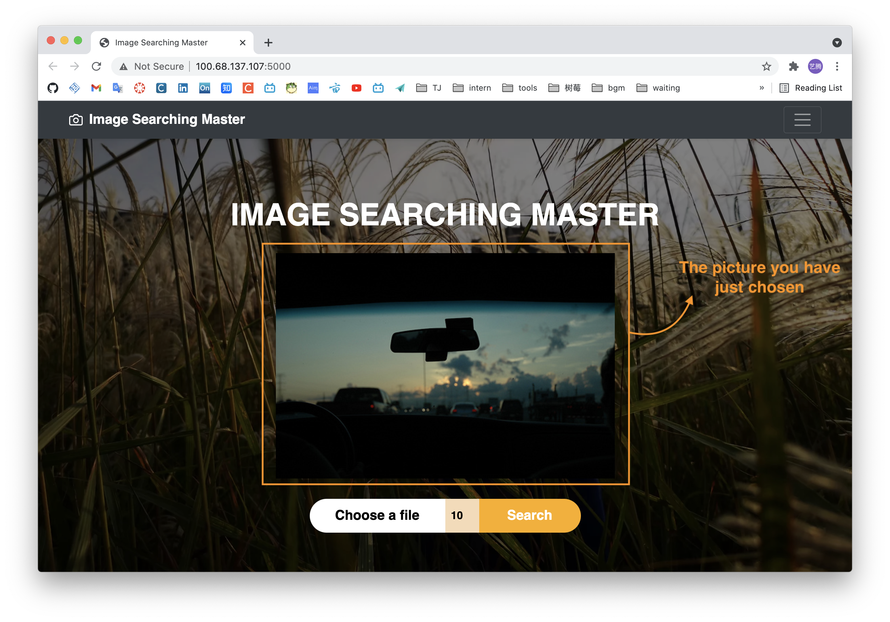
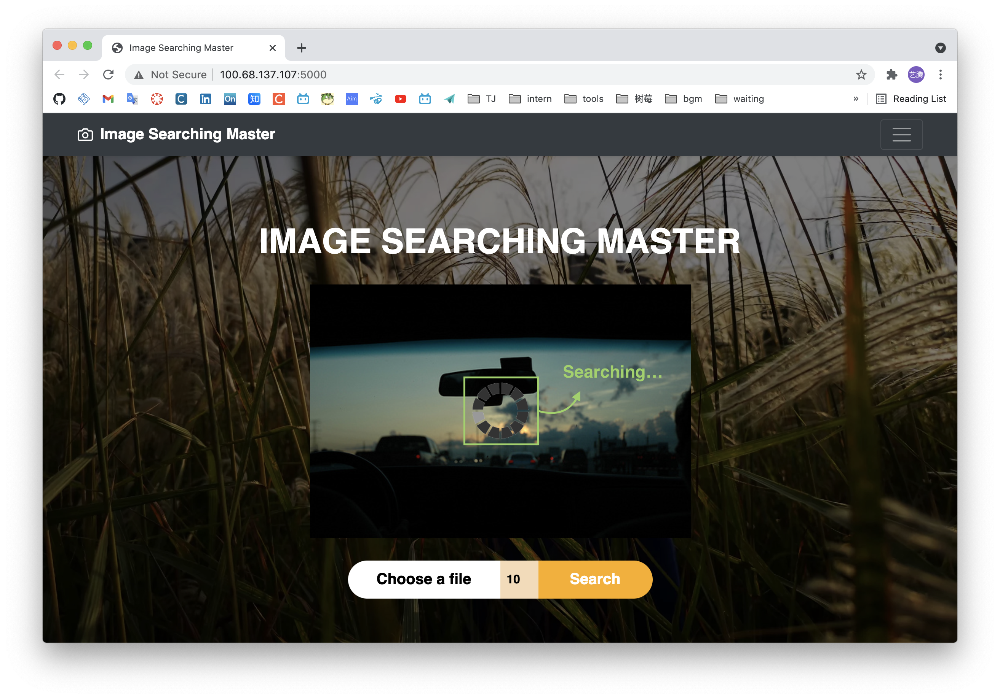
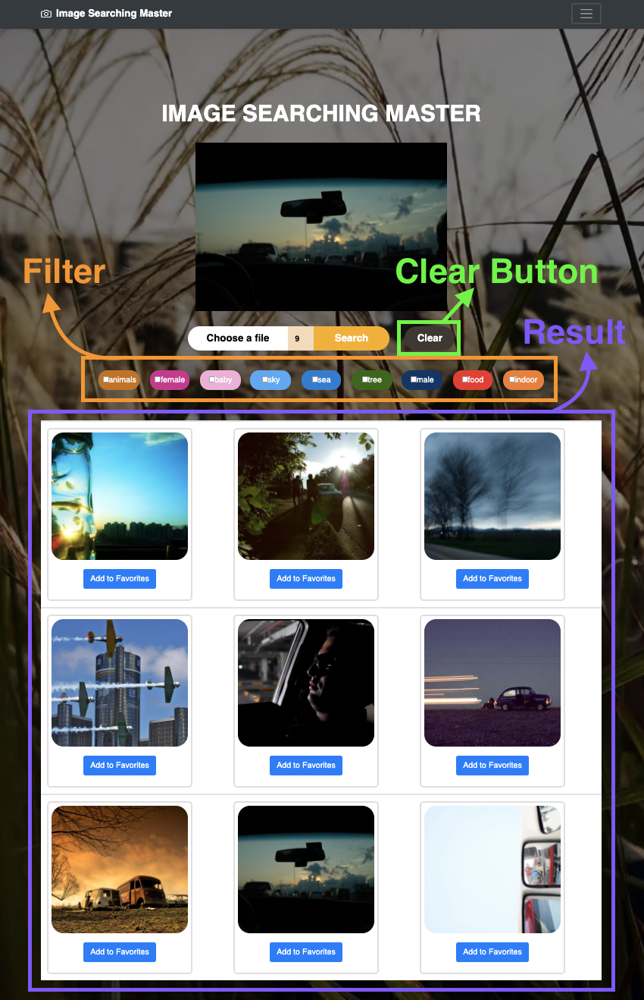

# Lab2 - Information Retrieval

| Name                 | ID      |
| -------------------- | ------- |
| Yiteng Zhang(张艺腾) | 1852137 |

[toc]

## 1. Requirements

1. Choose & Upload a picture
2. Show the picture which has been uploaded
3. Choose the amount of the results
4. Initiate searching (search button)
5. Show searching results
6. Filt results with tags and refine the results
7. Add pictures to favorite list
8. Delete pictures from favorite list


## 2. Design & Features

### 2.1 Formulation & Initiation of action

#### Start Page

* The title `IMAGE SEARCHING MASTER` shows the function of this search engine.
* The button on the left-top side can show and hide the `favorite list`
* The `Choose a file` button allows users to choose a picture to upload
* The `Search` button allows users to start the searching process
* The number between allows users to decide to show how many result pictures.
* The `Clear` button which is shown after searching allows users to clear the page.



#### View Window

Users can view the picture they have selected and can also change another one by re-click `Choose a file`  button.



#### Searching

There will have a gif to indicate that the searching is processing.



### 2.2 Review of results & Refinement

#### Review of Results

The results will be shown below the search block.



#### Refinement

There's some filt tag below the search bar, once select some tag, the result will be changed, only show the pictures fitting ==at least one selected tag==.(As the yellow box in the below picture)


### 2.3 Use

#### Add Favorite Pictures

Users can add a picture in to Favorites by clicking the `Add to Favorites` button below the certian picture.(As the pink box in the below picture)

⚠️The favorite pictures are ==synchronized to the back-end==, so the next time users open the page ,the favorite pictures will be loaded in to the favorite list and show again. Not just front-end. There's a specific folder `favorites` to save the favorite pictures.


#### Delete pictures from favorite list

Users can delete a picture from favorite list by clicking the `Remove ` under the certain picture.(As the green box in the above picture)

## 3. Implement

### 3.1 Searching function

* Send the image user has uploaded and the number user has input to the back-end by `ajax`.

* Back-end system searching the pictures and sent back pictures in `json` format.

* Show the pictures in the front web page.

  ```js
  $.ajax({
      url: 'imgUpload?searchNum=' + searchNum,
      type: 'POST',
      data: formData,
      //async: false,
      cache: false,
      contentType: false,
      enctype: 'multipart/form-data',
      processData: false,
  
      success: function (response) {
          $('#load').hide();
          $('#row1').show();
  
          var par;
          for (i = 0; i < searchNum; i++) {
          document.getElementById('img' + i).src = response['image' + i];
          par = document.getElementById('img' + i).parentNode;
          // par.childNodes[3].childNodes[1].text='Favorite';
          par.childNodes[3].childNodes[1].text = 'Add to Favorites';
          par.style.display = "";
          par.parentNode.parentNode.style.display = "";
          }
          document.getElementById('selects').style.display = "flex";
          $('#table').show();
          $('#clear').show();
  		}
  });
  ```

### 3.2 Adding and removing favorite pictures function

* Add a click function to the button below result pictures.
* Once the button is clicked, front page will send a request to back-end by `ajax`
* Back-end system will add/delete the certain picture in the `favorite` folder

#### ADD

```js
function addFav(index) {
  console.log("add to favorites!");
  var img = document.getElementById('img' + index);
  var fileName = img.src.split('/')[6];
  console.log(fileName);
  $.ajax({
    url: 'addFavImg?fileName=' + fileName,
    type: 'POST',
    data: fileName,
    success: function (response) {
      _src_ = response.src;
      console.log(_src_);
      favPics = document.getElementsByClassName("favP");
      have_flag = 0;
      for (i = 0; i < favPics.length; i++) {
        if (favPics[i].src.split('/')[4] == _src_.split('/')[2]) {
          have_flag = 1;
          console.log('duplicate');
          alert("you have already add it to favorites!");
          break;
        }
      }
      if (have_flag == 0) {
        btn = img.nextSibling.nextSibling.childNodes[1];
        btn.text = "Favorite";
      }

    },
    error: function () {
      console.log("failed add fav!");
    }
  });
}
```

#### DELETE

```js
function delFav(btn) {
  console.log("delete!");
  fatherDiv = btn.parentNode;
  grandpaDiv = fatherDiv.parentNode;
  src = fatherDiv.childNodes[1].childNodes[1].src;
  // ajax to tell back-end to delete favPics
  var formData = new FormData();
  name = src.split('/')[4];
  formData.append('name', src);
  $.ajax({
    url: 'delFavImg?fileName=' + name,
    type: 'POST',
    data: formData,
    //async: false,
    cache: false,
    contentType: false,
    enctype: 'multipart/form-data',
    processData: false,

    success: function (response) {
      console.log("delete successful!");
      grandpaDiv.removeChild(fatherDiv);
    }
  });
}
```


### 3.3 Show the favorite pictures

* Add a click function to the favorite list button
* Once the button is clicked, front page will send a request to back-end to get the pictures in `favorite` folder
* Back-end will read the `favorite` folder and send back the pictures in json format
* Show the pictures in the favorite list on the right of  front web page.

```js
function favoriteBar() {
  console.log("favoritesBar!");
  $.ajax({
    url: 'loadFavImg',
    type: 'POST',
    //async: false,
    cache: false,
    contentType: false,
    enctype: 'multipart/form-data',
    processData: false,

    success: function (response) {
      num = response.number;
      for (i = 0; i < num; i++) {
        document.getElementById('favCards').innerHTML +=
          "<div class=\"list-group list-group-flush border-bottom scrollarea\">\n" +
          "     <div class=\"favCard\">\n" +
          "          \n" +
          "     </div>\n" +
          "     <button onclick=\"delFav(this)\" class=\"remove\">Remove</button>\n" +
          "</div>";
      }
    }
  });
  if (fav == 0) {
    document.getElementById("fav").style.right = "0px";
    document.getElementById("favIco").style.transform = "rotate(90deg)";
    fav = 1;
  } else {
    document.getElementById("fav").style.right = "-380px";
    document.getElementById("favIco").style.transform = "rotate(0deg)";
    fav = 0;
  }
}
```


### Filting function

* Once a tag is changed the front-end will send a request to the back-end, include the tags which have been selected.
* Back-end system will check each pictures in the `result` folder and decides which pictures should been shown and sends back a list of the pictures which should be shown to the front-end in `json`.
* Front-end will show certain pictures on the page.

```js
function filt() {
  console.log("filting");
  checkboxs = document.getElementsByClassName("select");
  var selected = new Array()
  var cnt = 0;
  for (i = 0; i < checkboxs.length; i++) {
    if (checkboxs[i].checked) {
      console.log(checkboxs[i].parentNode.textContent);
      selected[cnt] = checkboxs[i].parentNode.textContent;
      cnt++;
    }
  }
  var formData = new FormData();
  var searchNum = document.getElementById("searchNum").value;
  formData.append('cate', selected);
  formData.append('searchNum', searchNum);
  $.ajax({
    url: 'filter',
    type: 'POST',
    data: formData,
    //async: false,
    cache: false,
    contentType: false,
    enctype: 'multipart/form-data',
    processData: false,

    success: function (response) {
      console.log("filting success!");
      console.log(response);
      for (i = 0; i < response['num']; i++) {
        document.getElementById('img' + i).src = response['image' + i];
        par = document.getElementById('img' + i).parentNode;
        par.childNodes[3].childNodes[1].text = 'Add to Favorites';
        par.style.display = "";
        par.parentNode.parentNode.style.display = "";
      }
      for (j = response['num']; j < 21; j++) {
        document.getElementById('img' + j).parentNode.style.display = 'none';
      }
    }
  })
}
```

## 4. Project Structure

```shell
├── image_vectorizer.py
├── neighbor_list_recom.pickle
├── rest-server.py
├── saved_features_recom.txt
├── search.py
├── database
│   └── dataset
│       └── images
├── static
│   ├── favorites
│   │   └── im1456.jpg
│   ├── images
│   │   ├── ajax-loader.gif
│   │   └── background.jpg
│   └── result
│       └── database
│           └── dataset
├── templates
│   ├── base.html
│   └── index.html
└── uploads

```

